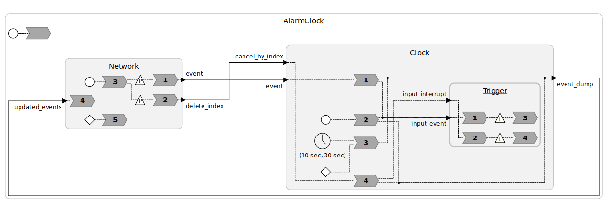

Lingua Franca Alarm Clock
----------------------------

**Contact:** <revol-xut@protonmail.com>

**Main Repository:** [](https://github.com/revol-xut/lf-alarm-clock)

A small and tiny alarmclock which is written using the scheduling and time features from lingua franca. 

## What you will learn

- sharing state between reactors
- stopping scheduled events

## Project




## Building

**Dependencies:** jdk11, boost, mpg321, crow

```bash
    $ lfc ./AlarmClock.lf
```

**Building with nix**

This cross compiles for aarch64.
```
    nix build .#packages.aarch64-linux.lf-alarm-clock
```

## Endpoints & Usage

### /list **GET**
Returns a list of upcoming events.

```json
    "timestamp": {
        "date": ""
        "message": ""
    }
```

**Examples**

```
$ curl http://0.0.0.0:8680/list
```

### /stop **GET**
Stops the currently playing alarm sound.

```json
{
    "success": "exit code"
}
```

**Examples**

```
$ curl http://0.0.0.0:8680/stop 
```

### /add_event_timestamp **POST**
Will schedule your alarmclock for the given timestamp

Request:
```json
{
    "message": "",
    "time_stamp": 0
}
```
Response:
```json
{
    "success": true
}
```

**Examples**

```
$ curl http://0.0.0.0:8680/add_event_timestamp -X POST -H "Content-Type: text/json" -d '{"message": "test", "time_stamp": 1643400000}'
```

Schedules event for given timestamp.

### /add_event_relative **POST**
Will schedule a event relative to the current time.

Request
```json
{
    "days": 0,
    "hours": 0,
    "minutes": 0,
    "seconds": 0 
}
```

Response:
```
{
    "success": true
}
```

**Example**

```
$ curl http://0.0.0.0:8680/add_event_relative -X POST -H "Content-Type: text/json" -d '{"hour": 6, "minute":0, "second": 0, "message": "hello"}'
```

Schedules sets your alarmclock to activate in 6 hours. 

### /add_event_time **POST**
Schedule event for this time in the next 24 hours. If a parameter
is unspecified the current time is used.

Request
```json
{
    "hour": 0,
    "minute": 0,
    "second": 0
}
```

Response:
```json
{
    "success": true
}
```
**Example**

```
    $ curl http://0.0.0.0:8680/add_event_time -X POST -H "Content-Type: text/json" -d '{"message": "test", "hour": 6, "minute":0, "second": 0, "message": "hello"}'
```

Schedules the event for the next time the given time occures.
